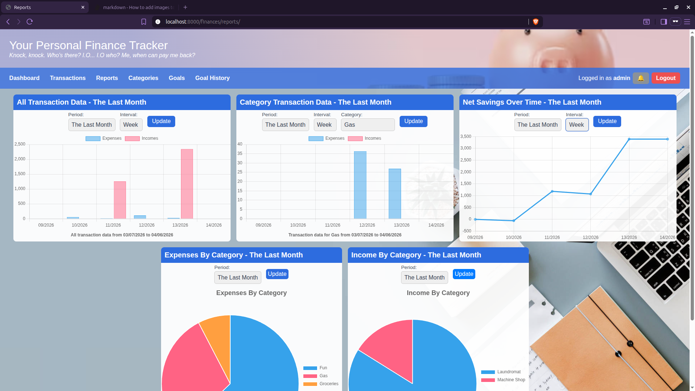

# Personal Finance and Budget Tracker
A web-based personal finance tracker for tracking your expenses and budget.




## Prerequisites

If you're on Linux, here are the prerequisite packages:

```
python3 (plus any additional packages that provide `pip` and `venv`)
build-essential
pkg-config
lib-mysqlclient-dev
```

The package names might differ based on the distro you use.

## Local development/debugging

### 1. Clone the project

Run `git clone https://github.com/familycrest/personal-finance-tracker` then `cd personal_finance_tracker`.

### 2. Create a `.env` file

Copy `.env.example` to just `.env` and fill in the important variables. Remember to set `DJANGO_DEBUG=1`.

### 3. Run the project!

#### Set up the app and environment

You only need to do this once: `chmod +x setup_app run_app setup_dev`

Then, setup development stuff: `./setup_dev`

#### Run the app

`./run_app`

## Deployment on a production environment

### 1. Configure the project

Deployment instructions are very similar to the instructions for local development, with these **required variables**:

- `DJANGO_DEBUG=0`
- `DOMAIN`: must be set to the full domain name the project is to be served on, e.g. `"myapp.mysite.com"`
- `PORT`: the *internal* port on which the app server will listen
- `STATIC_DIR`: must be a place accessible by the webserver of your choice (preferably outside of `/home`)
- `DJANGO_SECRET`: must be a cryptographically secure string
- `EMAIL_BACKEND="ses"`: technically the server will still start without it, but nobody will be able to sign up or login.
- `EMAIL_AUTH_SENDING_ADDRESS`: the domain of this address must be valid and verified with SES

Then, run `setup_app` (root permissions required).

### 2. Configure your environment

#### a. Configure the webserver

The app alone is not publicly accessible through the set domain name. Webservers (such as Nginx, Caddy, and Apache) receive requests in behalf of the app, handles SSL, and serve the app's static files.

The project comes with a sample Caddy configuration, which can be generated by:

```bash
set -a # automatically exports following envars
source .env # load the project config
envsubst < Caddyfile.example > Caddyfile # create the config file
cp Caddyfile /etc/caddy/ # load it into Caddy
sudo systemctl reload caddy # restart it
```

#### b. Configure AWS credentials

Using the SES backend requires installing AWS CLI. Authenticate with your access tokens by running `aws configure`

#### c. Run the server

`run_app` is the effective executable for the server, which you can point your process manager to.

#### d. Updating

Stop the app if it is running, pull the repository, then update with `setup_app`. This runs migrations and recollects all static files into `$STATIC_DIR`. Finally, restart the app.
