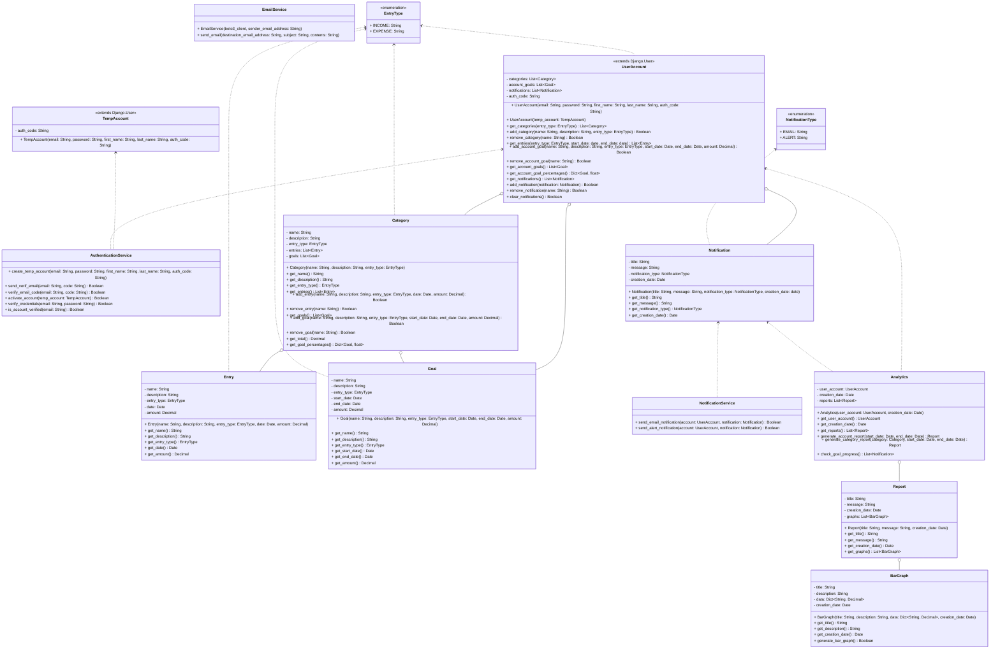

# UML Class Diagram V3

## Diagram




## Notes

### Changes to `Account` and `UserAccount`

They now extend Django's user authentication and storage system, which also handles session tokens.

### What's the signup/login process like? 
```

user asks for signup page
  < send back signup page with form
user submits signup form
  < send the "code entry" page
    ! set temp session cookie in request
  < send email with auth code
user enters auth code into "code entry" page
user submits form, along with session cookie
  ! if session cookie is still valid
    < redirect user to dashboard
      ! remove session cookie and replace with proper login cookie in request
    otherwise
    < redirect user back to signup page

? if the user signs up again with an existing TempAccount email:

- update the password and credentials
- set a new expiration date
- send a new code

? if the user signs up again with an existing email address:

- warn and ask them to login

? there'll be a button for the user to request a new auth code after a few minutes (as long as they keep the page open)

user asks for login page
  < send back login page with form
user submits login form
  ! if user credentials are valid
    < send the "code entry" page
      ! set temp session cookie in request
    < send email with auth code
user enters auth code into "code entry" page
user submits form, along with session cookie
  ! if session cookie is still valid
    < redirect user to dashboard
      ! remove session cookie and replace with proper login cookie in request
    otherwise
    < redirect user to signup page

```

### Why an email service?

The job of `EmailService` is simply to handle all of the interaction with AWS' email API and hide it behind a simple function that `AuthenticationService.send_verif_email()` and `NotificationService.send_email_notification()` can then use.
