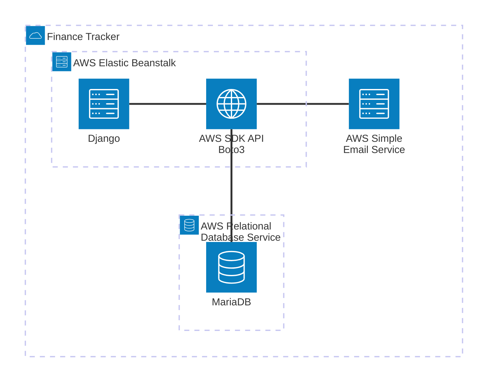

The main application instance is represented by the Django node. It uses the library Boto3 to communicate with the AWS SDK, and in turn integrate with AWS SES (Simple Email Service) and AWS RDS (Relational Database Service).

