# Installation Guide
**Project Name:** Personal Finance Tracker

**Team Number:** 7

**Team Project Manager:** Kenneth Stancil

**Team Members:** Layla Shuemate, Fatima Zaid, Jacob Teatro, Colton Stotler

### Introduction

This guide explains how to install everything you need to run a Django project. Django is a Python tool used to build websites, and it requires a few other programs—Python, pip, and SQLite—to work correctly. By following these steps, you will set up all the needed software so you can start creating and running your own Django projects.

### System Requirements

The requirements necessary to run the project are having python, pip, SQLite, and Django installed.

#### Install Python

1. Download the latest version of python from the provider's website: https://www.python.org/downloads/.

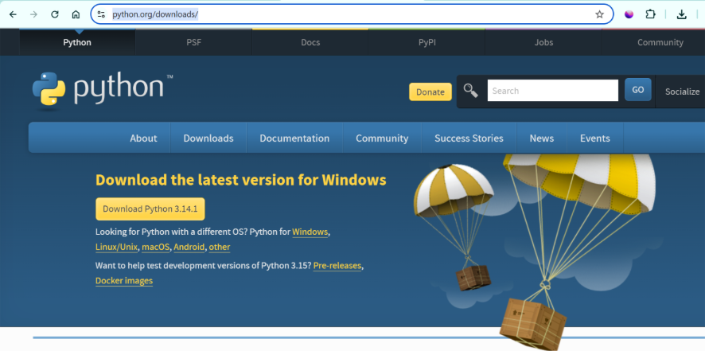

2. Make sure to select “Add Python to PATH” before clicking install.
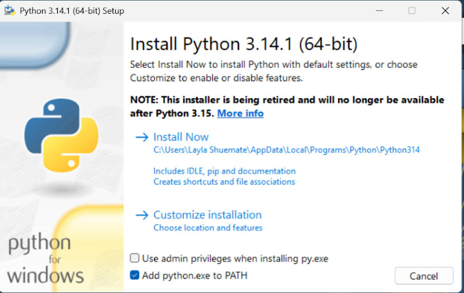

#### Install Pip

When you install python, pip is installed as well.

1. Verify using pip --version and python --version

2. If not, go to the pip website and download the latest version from there manually.
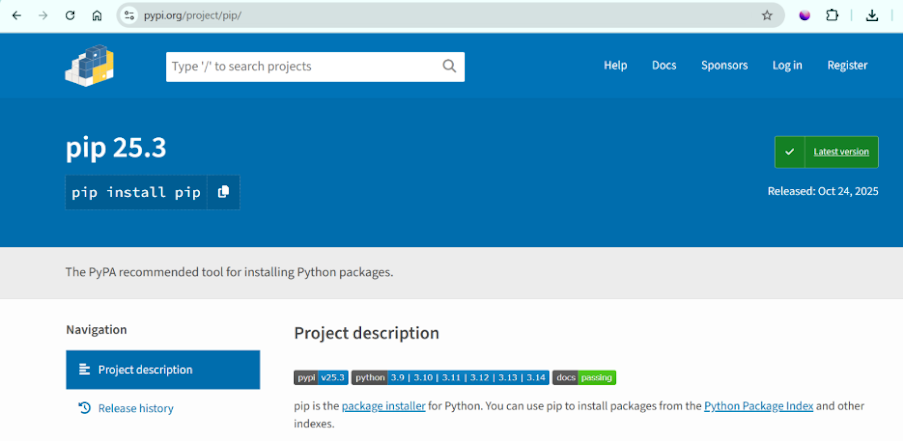

#### Install SQLite

For our project we decided to use a simple, lightweight database to organize data called SQLite. The website to download the software is https://www.sqlite.org/

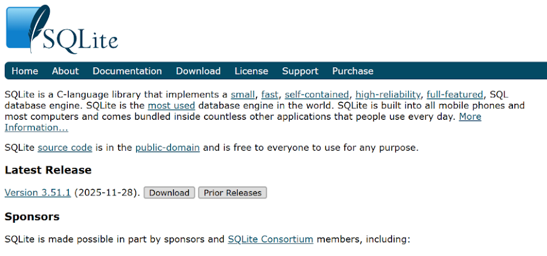

1. Download the SQLite zip folder.

2. Extract all.

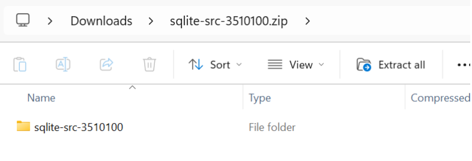

3. Extract.

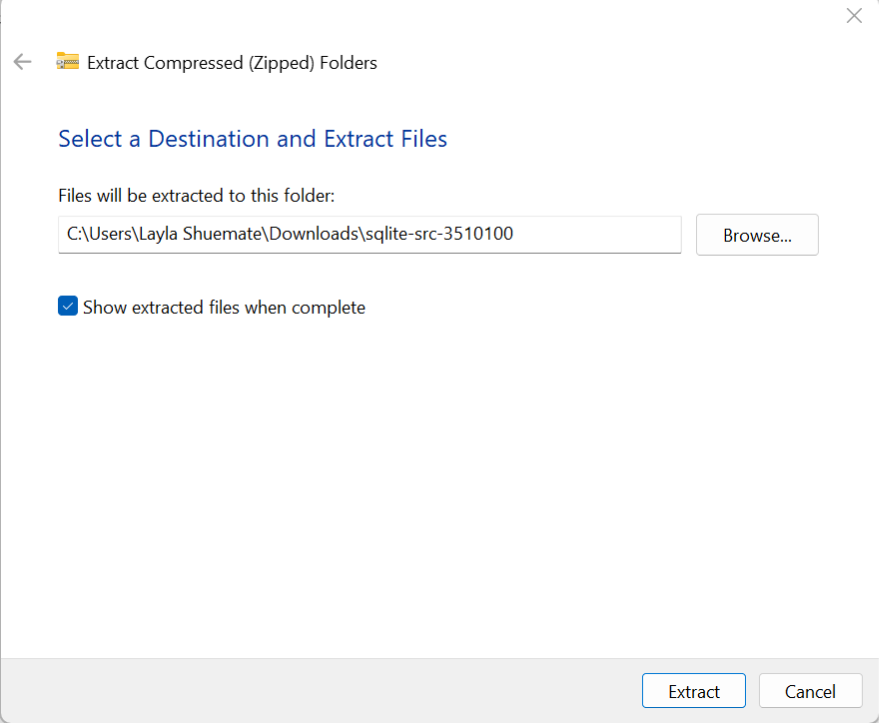

4. Once extracted you should be able to confirm the version on your system using sqlite3 --version

#### Downloading the Installer

Here is the website to download Django: https://www.djangoproject.com/download/

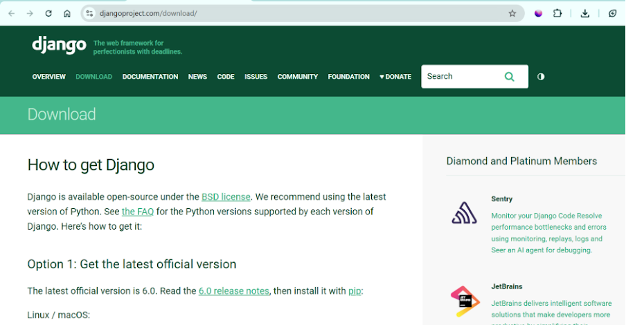

### Installing the Software

#### Download Django

**Option 1:** Download Django from the command line system wide

+ Windows: py -m pip install Django==6.0

+ Linux / MacOS: python -m pip install Django==6.0
 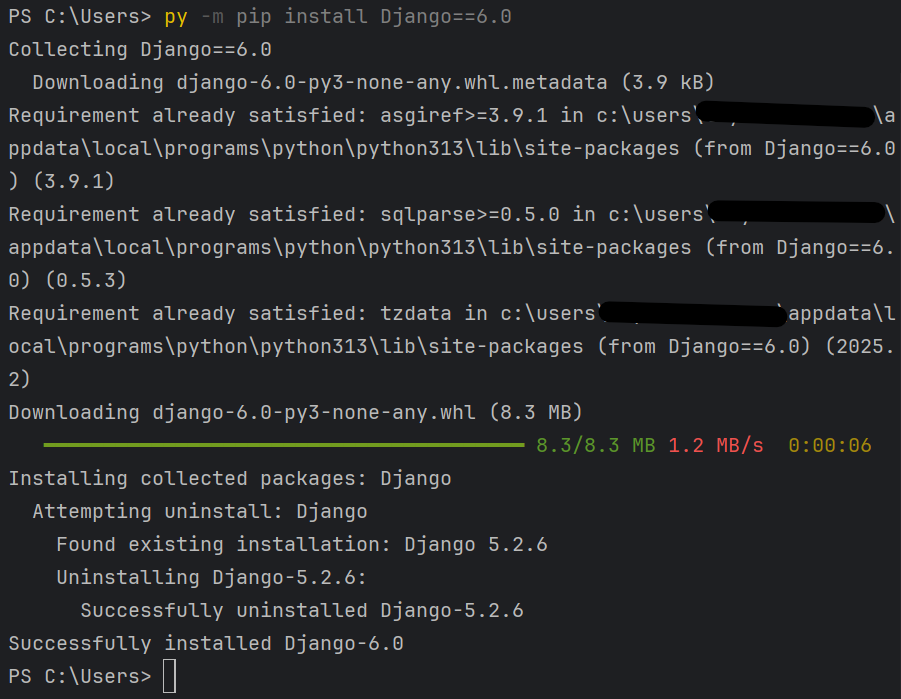

**Option 2:** Download Django from the command line for project only

1. Create a directory for your projects: **mkdir DjangoProject**
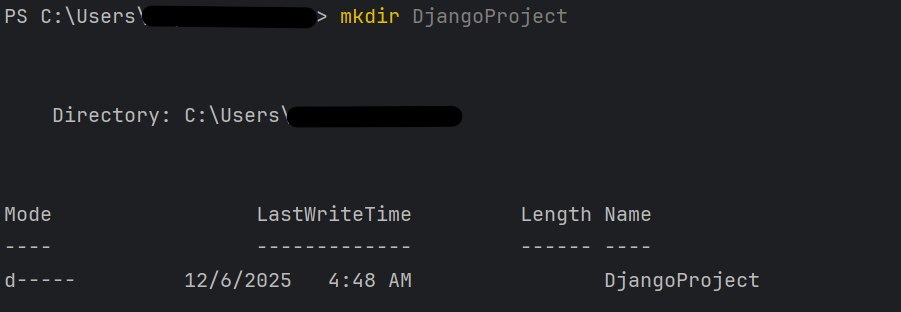

3. Enter the folder: **cd mkdir DjangoProject**

4. Create a virtual environment on your machine: **python –m venv venv**
5. Activate the virtual environment: **venv\Scripts\activate**
    + You know you’re in a virtual environment when you see (venv)
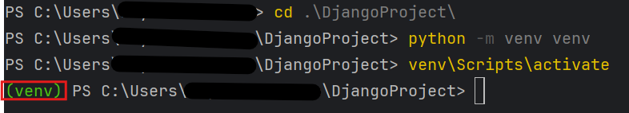

6. Proceed to install Django in the virtual environment: **pip install django**
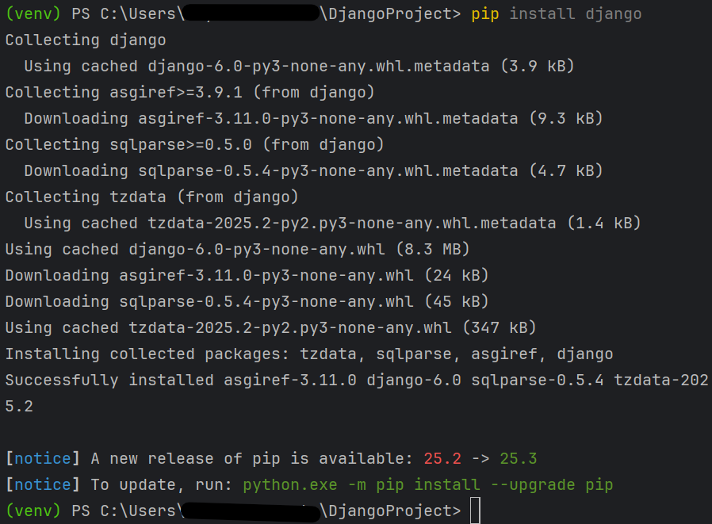

7. Verify the installation: **django-admin –version**
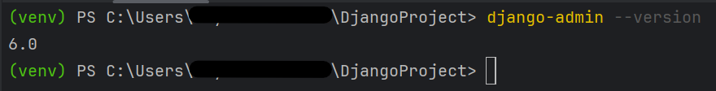

8. Start a project: **django-admin startproject myProject**

9. Enter the project folder: **cd myProject**
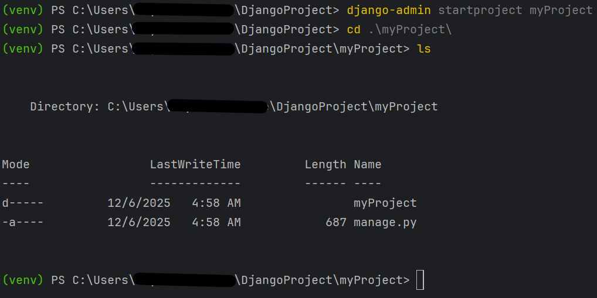
**You are now ready to begin working!**

### Launching the Software

1. To run the machine on localhost you will execute this code in the same folder level as the manage.py file: python manage.py runserver
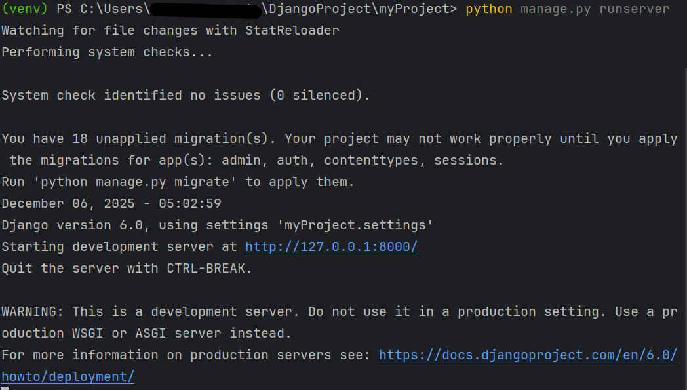

2. A localhost browser will pop up containing the application as long as there are no development errors.
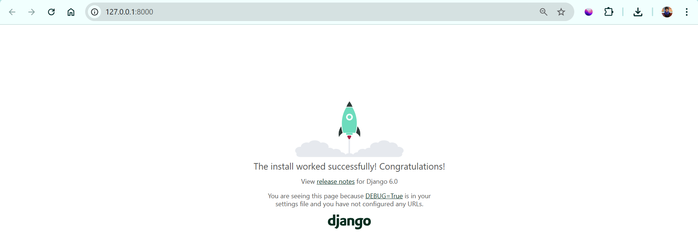

3. To stop the server, enter CTRL + C into the command line.

4. To deactivate the virtual machine (if you are using one) enter deactivate into the command line.
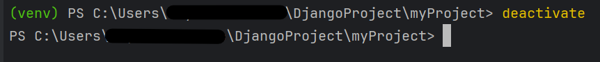

### Uninstalling the Software

#### Uninstall Django

+ Virtual Environment:

    1. Activate your virtual machine (if using one): venv\Scripts\activate

    2. Uninstall Django: pip uninstall django

    3. When asked to proceed, click y
    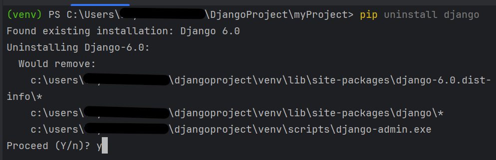

    4. Verify the installation is complete (should get nothing back): pip show django

+ Without virtual environment:

    1. Enter pip uninstall django

    2. Verify the installation is complete: django-admin --version

    3. After uninstalling, remove any and all Django project related files you see fit to clean up your machine.

### Troubleshooting

1. Python or pip not recognized?

    + Make sure Python and pip are added to your system during installation.

    + Verify the installation worked using the following commands:

        + python –version

        + pip --version

2. Virtual environment won’t activate?

    + On Windows, use: venv\Scripts\activate

    + Also, make sure you are in the folder where the virtual environment was created. It will not work if you are outside the folder. Use pwd to find where you are currently located.

3. Your Django installation failed?

    + Make sure to upgrade pip before starting Django

    + Use this code: python -m pip install --upgrade pip

    + Then try reinstalling Django again: pip install django

4. The port 8000 already in use when running the server?

    + Try using a different port: python manage.py runserver 8080

5. SQLite not working?

    + Make sure it is installed correctly and sqlite3 is in your PATH.

    + Verify the installation worked using the following command: sqlite3 --version

### Other General tips

+ Update your system using the command: sudo apt-get update

+ Always activate your virtual environment before installing Django.

+ Restart your terminal if changes to PATH don’t take effect.

+ Check official documentation if errors persist.

### Support and Contact Information

For support with Django installation, please reach out to Django customer service with any issues. Here is a link for common issues regarding installation:

Django:
+ FAQ: https://docs.djangoproject.com/en/5.2/faq/

+ Official Django Forum: https://forum.djangoproject.com/

Pip: https://pip.pypa.io/en/stable/installation/

Python: https://wiki.python.org/moin/BeginnersGuide or https://docs.python.org/3/using/index.html

SQLite: https://sqlite.org/support.html
