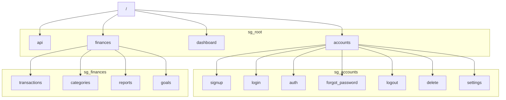

This diagram maps out the various endpoints on the site, including webpages as well as API endpoints in the future. Subgraph names are to be ignored.

```mermaid
graph TD
    root["/"]
    subgraph sg_root
        api
        accounts
        dashboard
        finances
    end

    root --> api
    root --> accounts
    root --> dashboard
    root --> finances

    subgraph sg_accounts
        direction LR
        signup
        login
        auth
        forgot_password
        logout
        delete
        settings
    end

    accounts --> signup
    accounts --> login
    accounts --> auth
    accounts --> logout
    accounts --> forgot_password
    accounts --> delete
    accounts --> settings

    subgraph sg_finances
        finances --> transactions
        finances --> categories
        finances --> reports
        finances --> goals
    end
```
