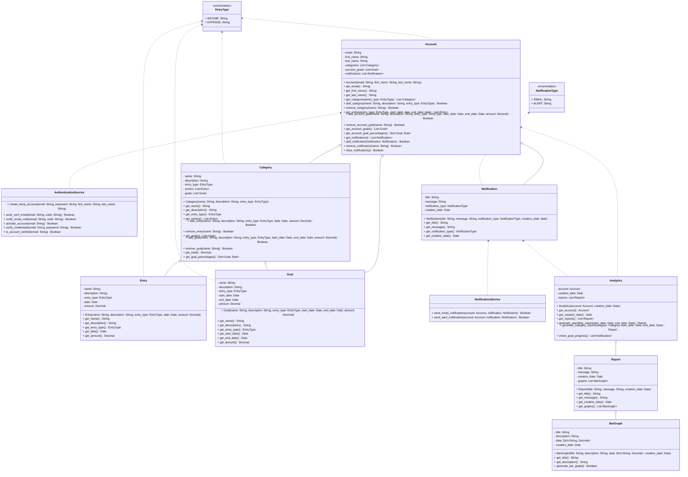

## Orignal UML Class Structure Issues: (Not about the one below)
- User:
  - User adds income and expenses to categories. This doesn't make any sense, because User only holds budgets and has no method to tell budget to add them to the category totals.
  - ~~Doesn't have a method to create or even call a method in an analytics object, nor does it hold a list of categories for it to be able to give the Analytics object.~~
    - Actually a controller could make analytics objects with the desired budget and categories, but it still shouldn't hold categories that the budgets already hold.

- Budget:
  - Budget doesn't have any way to hold individual expenses or salary. It can only add to a total of each of those. We need an entry / transaction object. But the same totals are in Category, too, which adds the risk of mismatching numbers and unnecessary complexity.
  - Budget doesn't even have a way to hold the actual budget, except when associated with a category. It has a categoryBudget attribute: Dict[Category, float], which makes no sense given you should ask the Category object what its budget is if you're holding it that way. But then the budget object is pointless!
  - Why do both Budget and Category hold total expenses and income? That should be the job of one of those.
  - Why is budget connected to reports? I don't think it should have a responsibility to create reports. It also doesn't have a method to do so.

- Category:
  - Shouldn't a category have budgets and not the other way around? The current way doesn't make sense, especially when you consider the category itself is associated with the actual number set for the budget and the budget only holds a list of numbers associated to categories.

- Analytics and Reports:
  - Analytics is the class that creates reports and bar graphs. However, analytics isn't connected to bar graph in the UML, and instead Report is. Even though report has no methods to create a graph or even an attribute to hold one.
  - ~~We need a more generic Graph class before a Bar Graph class.~~
    - Changed my mind on that.

